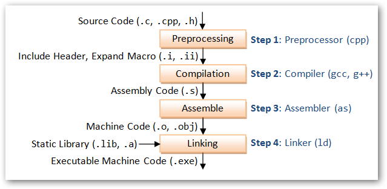

## 整体流程

**首先c++基本编译单元是.cpp**，每一个.cpp文件在完成预编译、编译、汇编之后，产生一个.o文件。gcc和g++以及汇编通过编译, 输出符号表, 符号表存储着源文件变量的符号，源文件通过编译生成的文件是二进制可重定位目标文件。.o文件的格式组成有:(由elf文件头可知存在) .text, .bss, .data, .symbal, section table...  .o文件是无法运行的,因为生成的符号没有分配虚拟地址，那么什么时候分配虚拟地址呢?链接过程中[^1]

## 预编译

把#include的头文件(.h)的内容，复制粘贴到.cpp文件中，称为(宏[macro]展开)，生成.i文件。

## 编译

经过c++编译器，将.i文件翻译成汇编代码，生成.s文件。

## 汇编

经过汇编器，将.s文件翻译成机器码，生成.o文件。

## 链接

把各.cpp产生的.o文件，以及库文件链接起来。

链接分为以下两步:

- 所有.o文件  **段**的合并, **符号表**合并后, 进行**符号解析**
- 链接的核心: **符号的重定位(重定向)**,重定向后生成可执行文件。

在静态链接下，会把当前.cpp文件引用的库文件和引用其他.cpp文件全部拷贝到当前文件下，并进行段的合并，符号表的合并。合并后进行符号解析，给变量分配虚拟地址空间。

- 缺点：如果有多个.cpp文件引用了相同的库文件，会导致该库文件在不同的.cpp文件下全都拷贝一份，造成空间的浪费。
- 优点：链接之后形成的可执行文件是可以直接运行的，即使把该文件拷贝到其他机器上也能够直接运行。

在动态链接下分为两种

(1) 装载时动态链接(Load-time Dynamic Linking)：这种用法的前提是在编译之前已经明确知道要调用DLL中的哪几个函数，编译时在目标文件中只保留必要的链接信息，而不含DLL函数的代码；当程序执行时，调用函数的时候利用链接信息加载DLL函数代码并在内存中将其链接入调用程序的执行空间中(**全部函数加载进内存**），其主要目的是便于代码共享。（动态加载程序，处在加载阶段，主要为了共享代码，共享代码内存）

(2) 运行时动态链接(Run-time Dynamic Linking)：这种方式是指在编译之前并不知道将会调用哪些DLL函数，完全是在运行过程中根据需要决定应调用哪个函数，将其加载到内存中（**只加载调用的函数进内存**），并标识内存地址，其他程序也可以使用该程序，并用LoadLibrary和GetProcAddress动态获得DLL函数的入口地址。（dll在内存中只存在一份，处在运行阶段）

上述的区别主要在于阶段不同，编译器是否知道进程要调用的dll函数。动态加载在编译时知道所调用的函数，而在运行态时则必须不知道。[^2]

## 参考

[^1]: [c/c++底层代码那些事](https://juejin.cn/post/6898145845691367432)
[^2]: [动态链接和静态链接的区别](https://www.cnblogs.com/tracylee/archive/2012/10/15/2723816.html)
[^3]: [计算机那些事(5)——链接、静态链接、动态链接](http://chuquan.me/2018/06/03/linking-static-linking-dynamic-linking/)
[^4]: [彻底搞懂程序链接过程之动态链接](https://www.eet-china.com/mp/a62093.html)

